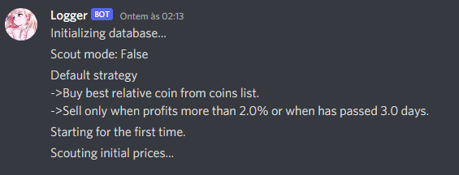

#  Trade Bot
A crypto trading bot written in python.

## How works
The idea is that the bot scouts multiple coins each minute and, according to the strategy, decides which is the best to buy and when to sell.

##  Run
From root directory runs `python main.py`

##  How to install

### Install python dependencies
From root directory runs on terminal `pip install -r requirements.txt`
    
### Create .env
Create a file named `config/.env` based on `config/.env.example`, then configure all your environment variables. 

#### Environment variables
- `API_KEY` - API Key from Binance. 
- `API_SECRET` - API secret from Binance. 
- `DATABASE_URL` - Database url (only postgres). 
- `DISCORD_WEBHOOK_URL` - Discord webhook url (only necessary when using discord logger). 
- `DISCORD_USER_ID_MENTION` - Discord user id to mention (only necessary when using discord logger).
- `DISCORD_WEBHOOK_USERNAME` - Discord webhook username (only necessary when using discord logger).
- `DISCORD_WEBHOOK_AVATAR` - Discord webhook avatar image url (only necessary when using discord logger).

### Logger
If you define a `DISCORD_WEBHOOK_URL` env var, the bot will use the discord logger, if not, the bot will use the default logger.
Even if you don't want to use the discord logger, all the environment variables related to discord have to be on the .env file, but they need to be empty.

##  How to backtest
With the backtest you can test the strategy simulating the market with crypto data historic.

### Downloading the data
You can download the crypto historical data on [cryptodatadownload](https://www.cryptodatadownload.com/data/binance/).
Download the data `Minute` for each coin in `config/coin_list.txt`.

### Preparing the data
Remove the Headers from all .csv files and run the `data/db_historic.py` script to create a database with all coins historic.

### Running the backtest
From root directory runs `python backtest.py`.

### Backtest summary
Backtest when finished will create a summary.json where you can run the `backtest/summary_view.py` to plot and resume the backtest.

## Deploy on heroku

## Disclaimer
This project is for informational purposes only. Do not risk money that you are afraid to lose. 
If you plan to use real money, USE AT YOUR OWN RISK.
Under no circumstances will I be held responsible or liable in any way for any claims, damages, losses, expenses, costs, or liabilities whatsoever, including, without limitation, any direct or indirect damages for loss of profits.
